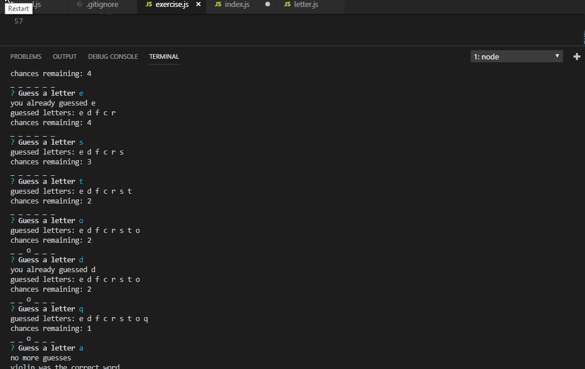

# Word-Guessing Game(node js)
## Object oriented CLI game using node.js

## Game Play

- Players begin each round with 8 guesses and a random word
- Only a single letter may be guessed at a time
- Each incorrect guess lowers the guess count by one
- Correctly guessed letters will appear in place of empty lines 
- Correctly guessed letters will not effect the guess count.
- To start the game, please navigate to the directory and find the file used
in your terminal

## Technologies/New tools used
- npm modules, (specifically inquirer)
- node.js (command line interface)
- module.export
- require

